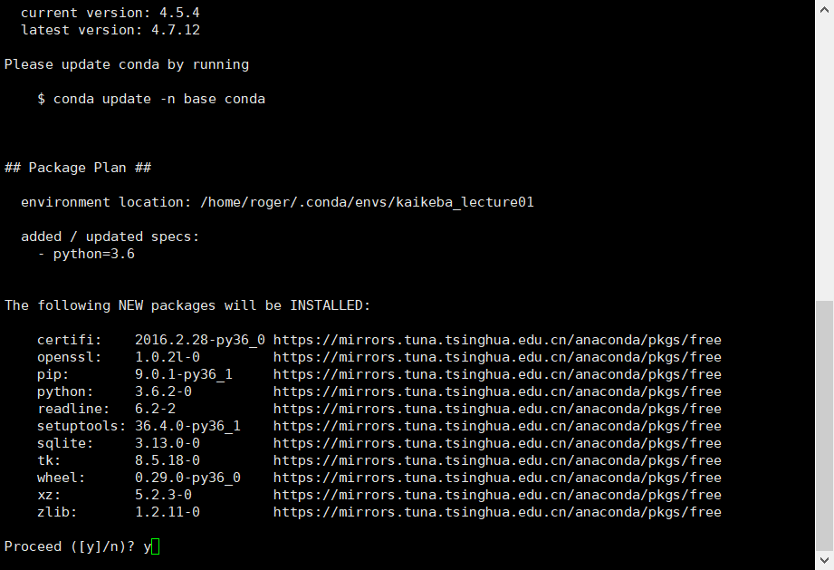
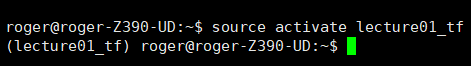
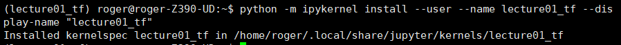
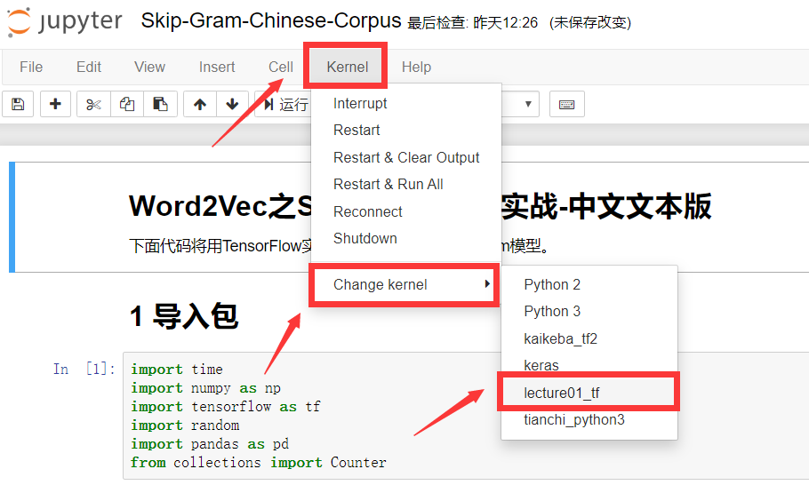
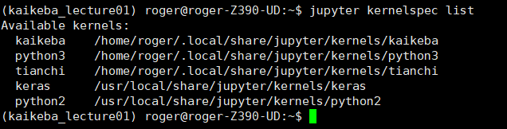

# Lecture1 环境搭建

# 1.安装anaconda

[参考](https://blog.csdn.net/luojie140/article/details/78696330)


# 2.创建虚拟环境
`conda create -n lecture01_tf python=3.6`


# 3. 激活虚拟环境
`source activate lecture01_tf`



# 4.安装必要的包

`
pip install -r requirements.txt
`

## 5.内核管理


### 5.1 设置内核

`--name` `conda环境名`
`--display-name` `在jupyter选项里面选择的名字`


```
python -m ipykernel install --user --name lecture01_tf --display-name "lecture01_tf"
```






> 完成以上步骤就可以在jupyter中使用环境了。

----
## 内核列表
`
jupyter kernelspec list
`



## 内核删除
`
jupyter kernelspec remove kaikeba  
`

